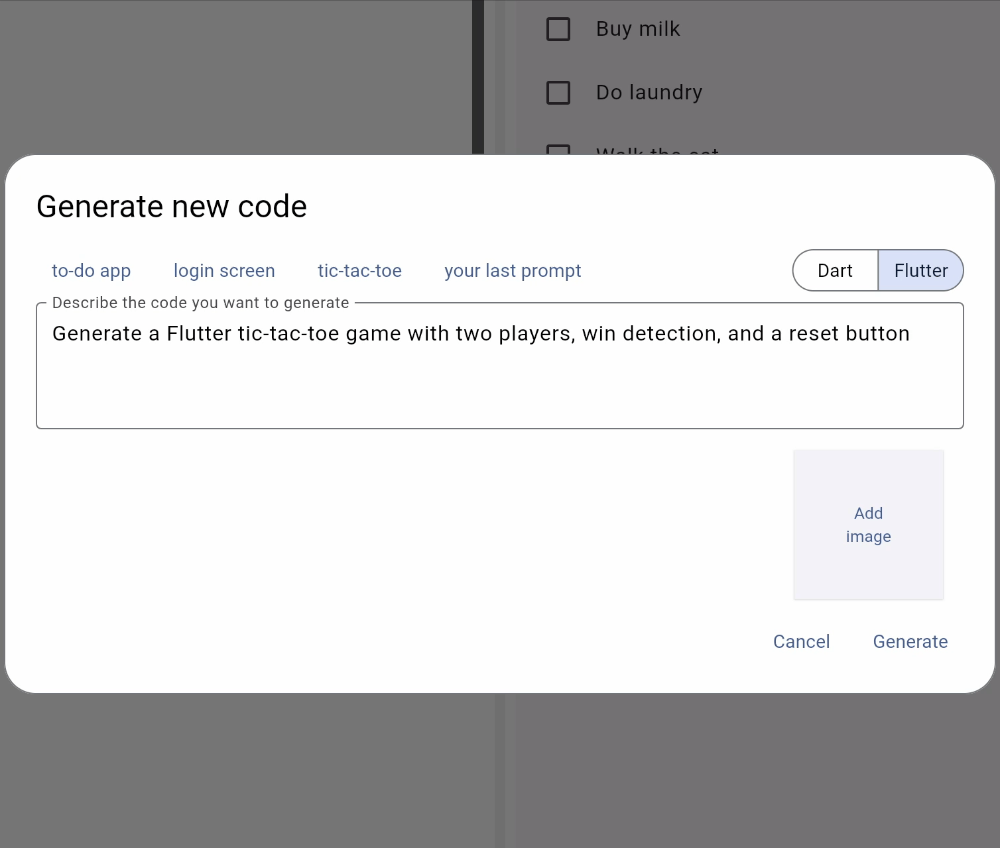
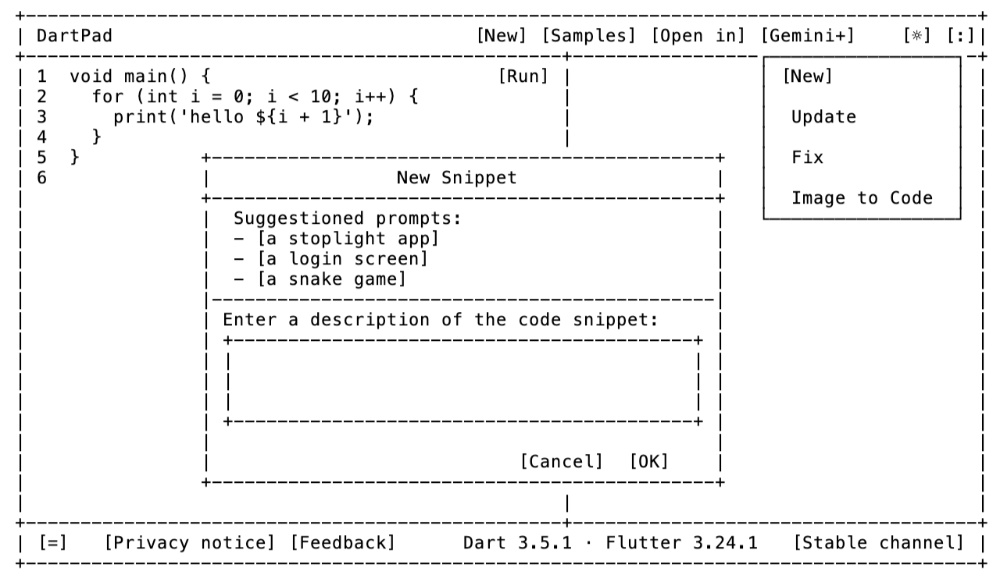
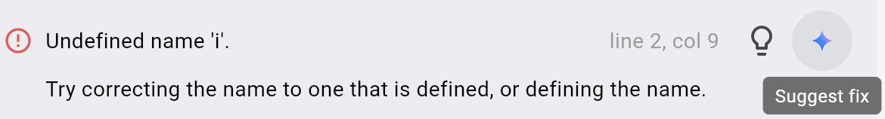
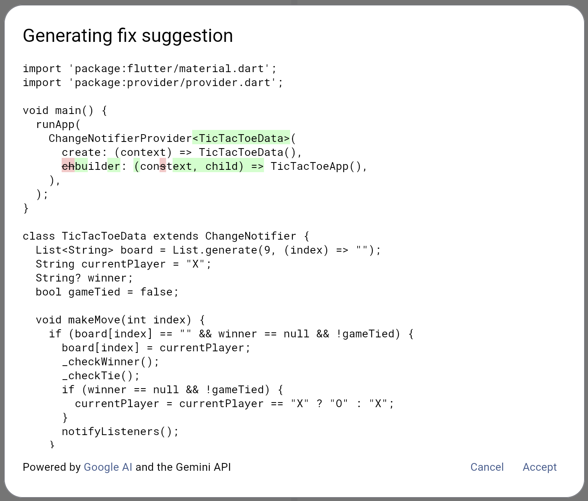
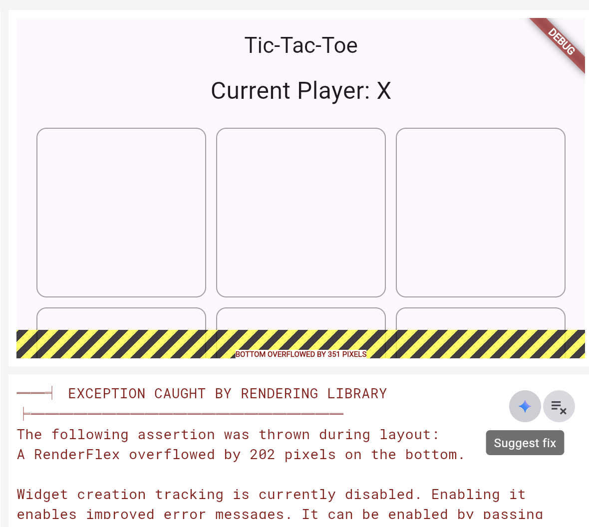
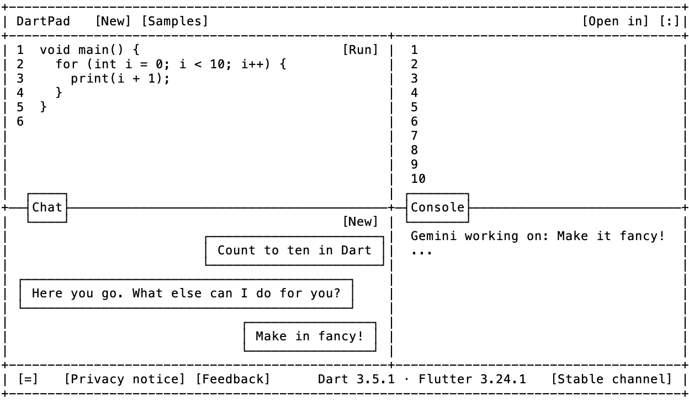

Tags: flutter

# Building Generative AI for DartPad

Hello, again, and welcome to another installment of “Flutter + AI = Joy.” In today’s episode, we’re taking a behind-the-scenes look at the design and implementation of the generative AI features in [the latest version of DartPad](https://dartpad.dev). Before we get started, if you haven’t already [read Amanda’s most excellent blog post](https://medium.com/dartlang/gemini-for-dartpad-ca962729cee6) for an overview of the new functionality, I recommend starting there.

## Streaming Responses

The first thing I needed to do to enable generative AI in DartPad was to add support for streaming responses. Even as fast as Gemini 2.0 Flash is, if you have to wait for the complete code for anything beyond Dart “hello, world”, you’re gonna get antsy.

The backend service for DartPad is built on top of [shelf](https://pub.dev/packages/shelf), the package that provided server-wide support for Dart before it was cool. Shelf supports streaming, but [the docs aren’t exactly available on the topic](https://pub.dev/documentation/shelf/latest/search.html?q=stream). Also, streaming hasn’t been used in DartPad before, so it was a bit of an experiment. [Ultimately](https://github.com/dart-lang/dart-pad/blob/c2f4fe190567806dc1d633e9a8b1c7007cbde366/pkgs/dart_services/lib/src/common_server.dart#L382) I turned gzip and I/O buffering off for the code-gen API endpoints and streamed the generated code back as UTF8-encoded bytes, which the client is expected to decode.

And this worked great – the server sent data back in chunks of bytes and the client decoded them back into a string, updating the UI for each chunk that it received. Except that the client only got one chunk with the complete response for every request. And this was true even though the server was sending back multiple chunks as Gemini provided them. So what was the problem?

It took a ridiculously long time (days!) to figure out that [the Dart http package](https://pub.dev/packages/http) on the web was using [XMLHttpRequest](https://developer.mozilla.org/en-US/docs/Web/API/XMLHttpRequest), which collapsed streaming responses into a single response, killing any chance to provide progress updates. With some hacking around, I figured out that [the fetch API](https://developer.mozilla.org/en-US/docs/Web/API/Fetch_API) did the right thing, so the http package needed an update. I discovered this in February of 2025. The good news is that the Dart team had already done that work in November of 2024 and that [the PR](https://github.com/dart-lang/http/pull/1401) was pending! Once that PR landed, we were good to go.

## Error Handling

My initial design proposal called for adding a Gemini menu to DartPad with New, Update, Fix and Image to Code functionality:

Image to Code was bundled together with Dart/Flutter Snippet (New) and Update code (Update) via the ability to attach images. Bringing up a dialog to enter a prompt made sense for New and Update, since DartPad doesn’t know what kind of code you want to generate or what updates you want to make.

For Fix, however, it was annoying to have to tell DartPad what the error was, since the analyzer was reporting the errors to me! So I hijacked the analyzer error message UI with the idea of building the prompt to suggest a fix for the user. The result is that now there’s a lightbulb to indicate analyzer messages and to provide an easy way for the user to trigger the menu of potential fixes. Right next to that, I added a Gemini sparkle icon:

Clicking on the sparkle bundles up the error message automatically, asks Gemini for a fix and provides you a diff:

That’s just magic! Once I had it working for analyzer errors, I needed it for run-time errors, too, so I added the Gemini sparkle to the console output window.

When you press on the sparkle icon in this case, DartPad will bundle up your run-time error and suggest a fix. 

Unfortunately, there was some work to enable the magic for run-time errors. Previously, there had been no reason to distinguish between normal console output and error output. That meant there was no good way to decide when to show the blue sparkle. However, you certainly do not want to show the Suggest Fix button when a Dart app is printing the last 10 numbers of pi. Luckily, [John Ryan](https://github.com/johnpryan), Flutter DevRel and engineering lead for DartPad, came to the rescue with [a fix](https://github.com/dart-lang/dart-pad/pull/3162) that allowed me to reliably show the blue sparkle only when it was needed.

## UX Shortcuts

After a long time on Unix before Windows and a long time on Windows before Mac, I’ve become a keyboard guy. I want to know all of the keyboard shortcuts so I can avoid using the mouse. While building and testing DartPad, I spent a lot of time in the prompt and code generating dialogs, both of which require you to press the Accept button. So I was doing that a lot. This annoyed me, so I added a keyboard shortcut:

- Ctrl+Enter (Cmd+Enter on macOS) will trigger the Accept action

And because I’m super lazy:

- Accepting the generated code will trigger the Run action

- Or if hot reload is enabled, the Reload action will be triggered instead

I added all of this simply because I couldn’t figure out a case when that isn’t what you wanted to happen. This means that you can enter your prompt, press Ctrl/Cmd+Enter once to generate the code, then again to accept it and it will automatically be run/reloaded for you. No muss, no fuss. No [mouses](https://en.wikipedia.org/wiki/Computer_mouse#:~:text=A computer mouse (plural mice,motion relative to a surface.) harmed in the creation of this feature.

> “Necessity is not the mother of invention; laziness is.” –J. Michael Sells (my dad)

## Future Hopes & Dreams

The initial goal for adding generative AI features to DartPad was to do so with a simple one-and-done style prompt in a modal dialog instead of the multiple prompts of a chat-style UI. Plus, by adding the new functionality without interfering with any of the existing DartPad UI, we could test it first to see if anyone cared.

It’s already apparent that you care. And that you *really* don’t like the modal dialogs. Instead, you want the prompt and iterate style of a chat interface (aka [vibe coding](https://x.com/karpathy/status/1886192184808149383)). Toward that end, personally I’d like to see DartPad move towards something like this in the future:

What do you think? How would you like DartPad to work wrt generative AI? Please drop your thoughts below!