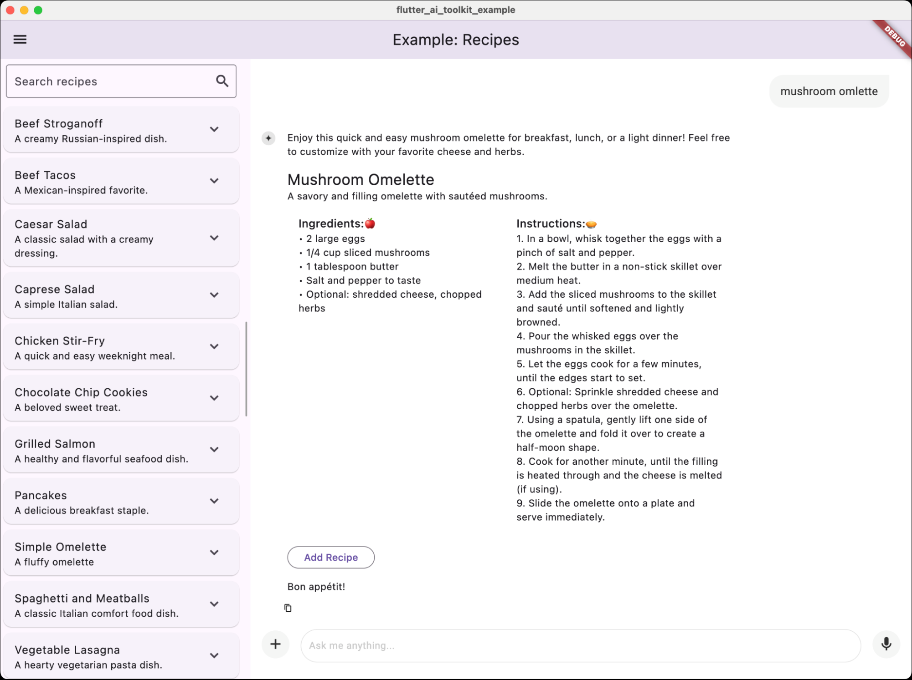

Tags: flutter

# Building the Flutter AI Toolkit


It has been quite an exciting few years since I left Google in 2022\. I had been on the Flutter team for 3 years by that point, helping it go from v1.0 to v3.0, from hundreds of thousands of users to millions. It was exciting, but time for a change. And boy did I get some\! Over the next 3 years I did the following:

- Worked on the developer experience for VR/AR/XR at Meta in their Reality Labs division.  
- Helped to ship the v1.0 for both the consumer and the enterprise versions of Cody from Sourcegraph, a long-time start-up with amazing code search capabilities. Seriously, if you haven’t tried [Sourcegraph Code Search](https://sourcegraph.com/code-search), you should. And if your company is using Code Search, [their AI coding assistant Cody](https://sourcegraph.com/cody) integrates with the same code. Give ‘em both a try\!  
- Retired from full-time employment after a 35-year software engineering career (and more than that if you count when I started writing code on my Apple \]\[+ at the age of 14).  
- Put up [my shingle](https://sellsbrothers.com) as an independent consultant specializing in applied AI.  
- Built [the Flutter AI Toolkit](https://pub.dev/packages/flutter_ai_toolkit).  
- Started giving Flutter talks again with [Dart and Flutter and AI, Oh My\!](https://www.droidcon.com/2024/10/17/dart-and-flutter-and-ai-oh-my/) at FlutterCon in 2024 (you click the link to watch the talk).  
- Built the generative AI features in [the latest version of DartPad](https://dartpad.dev/).  
- Have built some other AI stuff too that hasn’t shipped yet. Stay tuned\!

Even before I left the Flutter team, I was spending my spare time digging into AI. When I was at Meta, I was focused on xR, but again, spending my spare time on AI. And then [ChatGPT flipped the table](https://en.wikipedia.org/wiki/ChatGPT), so when the opportunity to work on AI in the developer tooling space came up, I couldn’t say “no.”

In June of last year, I decided that I wanted to control my own time again, so I “retired.” That’s not to say that I wanted to stop the work – I love what I do – it’s just that my pesky job was taking up all my time. As the VP of Product, I had all kinds of influence on what other folks did but no time to get my own hands dirty\! Once I retired, of course, I wanted to spend time with Flutter; it’s got the best API, the best team and the best community in tech, and I’ve seen more than my share. But now I had a new focus: applied generative AI.

The first thing I did in this new area was work with the Flutter and Firebase teams on the creation and application of the Flutter AI Toolkit.

## Hello, Flutter AI Toolkit

The goal of the [Flutter AI Toolkit](https://pub.dev/packages/flutter_ai_toolkit) (or just AIT from now on) is that it provides an LLM chat widget that you can easily plug into your existing Flutter apps. The Flutter team shipped the initial version in December, 2024, which you can read all about in [Amanda’s most excellent blog post](https://medium.com/flutter/announcing-flutter-ai-toolkit-e36b16a840d2) on the topic. Since then, I’ve been taking user feedback to add new features and fix issues. The current version as I write this is 0.6.8 but I’m going to be shipping a 0.7.0 soon.

To get started, I’ll refer you to [the flutter\_ai\_toolkit package README](https://pub.dev/packages/flutter_ai_toolkit). Once you’ve done that, a minimal chat app in Flutter using Gemini 2.0 is as easy as this:

```dart
import 'package:flutter/material.dart';
import 'package:flutter_ai_toolkit/flutter_ai_toolkit.dart';
import 'package:google_generative_ai/google_generative_ai.dart';

void main() => runApp(_MainApp());

class _MainApp extends StatelessWidget {
  @override
  Widget build(BuildContext context) => MaterialApp(
    home: Scaffold(
      body: LlmChatView(
        provider: GeminiProvider(
          model: GenerativeModel(
            model: 'gemini-2.0-flash',
            apiKey: 'GEMINI-API-KEY',
          ),
        ),
      ),
    ),
  );
}
```

There’s not much to this code, but it brings up some interesting points anyway:

- The name of the chat widget is `LlmChatView`  
- It supports many options, but only one is required – a provider that connects your LLM to the features needed by the chat widget  
- There are two LLM providers that come out of the box: `GeminiProvider` and `VertexProvider`  
- These two providers both take a `GenerativeModel` instance provided by the [Google AI Dart SDK](https://pub.dev/packages/google_generative_ai) and [Vertex AI in Firebase Flutter](https://pub.dev/packages/firebase_vertexai) packages respectively, enabling you to configure them fully as you choose.  
- The separation of the chat widget from the communication channel with the LLM allows you to plug in any LLM-like service you’d like.

If you run this code, you’ll get a very simple, but fully functional, cross-platform AI chat app. A [slightly fancier version](https://github.com/flutter/ai/blob/main/example/lib/demo/demo.dart) is hosted online that you can [try right now](https://flutter-ai-toolkit-examp-60bad.web.app/). It looks like this by default:


Notice the suggestions and the welcome message, both of which you can specify as optional parameters to `LlmChatView`. Also notice the \+ button, which allows the user to upload an image or a file, and the mic button, which allows the user to provide voice input.

## Custom Styling

Beyond the basic look ‘n’ feel, the [demo](https://github.com/flutter/ai/blob/main/example/lib/demo/demo.dart) example also provides some styling options:


Out of the box, the Flutter AI Toolkit supports being hosted in `MaterialApp` or `CupertinoApp`. However, as of the pre-release status at the time of this writing, it does not automatically adapt to the current theme provided by either. Instead, the look ‘n’ feel was designed by a Google UX designer to have its own modern style. And if you’d like to tailor it to your app, you have complete control (as you can see above). Check out the [dark\_mode](https://github.com/flutter/ai/blob/main/example/lib/dark_mode/dark_mode.dart) and [custom\_styles](https://github.com/flutter/ai/blob/main/example/lib/custom_styles/custom_styles.dart) examples for the details.

When I went to implement styling support, I took my inspiration for the styling support from [the flutter\_markdown package](https://pub.dev/packages/flutter_markdown). Theming is great for when you’d like to have a lot of a widget in your app, e.g. you don’t want to set the styles for each `Text` widget – you want to use a theme for that. However, I figured that you’d have about one `LlmChatView` widget, so theming didn’t make as much sense as just passing in a style object like you can do with the `Markdown` widget.

That said, it’s an obviously missing feature to be able to add the ability to pick up on the current Material or Cupertino theme and set those as defaults for an `LlmChatWidget`. If this is something you're passionate about, [PRs are gladly considered](https://github.com/flutter/ai/pulls)\!

### Custom Response Widgets: Beyond Text

By default, the AIT shows LLM responses as Markdown:


But what if you want the AI to respond with something richer – like a card UI, a chart or a recipe? As an example, consider [a recipes app](https://github.com/flutter/ai/blob/main/example/lib/recipes/pages/home_page.dart) that allows the user to maintain a database and to add to it via a conversation with an LLM. To be able to get the data out of the LLM to add to the database, you don’t want to scrape it out of Markdown – you want well-formed data that you can parse reliably. You can get that by [configuring your model to output JSON](https://github.com/flutter/ai/blob/main/example/lib/recipes/pages/home_page.dart#L33). By default, that JSON would look like this when shown to the user:


Of course, this isn’t particularly useful for the user, so the AIT allows you to show your own Flutter widget, [as the recipe example does](https://github.com/flutter/ai/blob/main/example/lib/recipes/views/recipe_response_view.dart):





In addition to showing the recipe in a way the user can read, the example also provides an Add Recipe button to allow the user to easily drop the recipe into their database, all from the comfort of their AI chat.

## Pluggable LLMs

As big of a fan as I am of the Gemini models ([2.5 pro experimental](https://blog.google/technology/google-deepmind/gemini-model-thinking-updates-march-2025/) is blowing the doors off as I write this), different apps have different needs. Since I had to make LLMs pluggable to support Gemini and Vertex (both of which have their own API over the Gemini LLMs), I thought it would be useful to support the ability to talk to any LLM-like backend. And the community has responded with [the flutter\_ai\_providers package](https://pub.dev/packages/flutter_ai_providers). Together with what comes out of the box and what is provided by the community, the AIT supports the following models:

- Google Gemini 1.x and 2.x, flash and pro, stable and experimental  
- OpenAI GPT and o series of models  
- Anthropic Claude series of models  
- 100s of locally hosted Ollama models, including Google Gemma3, QWQ, Deepseek, Llama3.x, etc.

If that isn’t enough for you, you can implement [the `LlmProvider` interface](https://pub.dev/documentation/flutter_ai_toolkit/latest/flutter_ai_toolkit/LlmProvider-class.html) and plug in anything you like. For debugging purposes, I built [`EchoProvider`](https://github.com/flutter/ai/blob/main/lib/src/providers/implementations/echo_provider.dart) but my favorite use of this feature is hooking up the `LlmChatView` to [flows that I define in Firebase Genkit](https://firebase.google.com/docs/genkit/flows).

Check out [the AI Toolkit docs](https://docs.flutter.dev/ai-toolkit/custom-llm-providers) for more details, but it’s a pretty simple interface. Even the Gemini and Vertex AI providers are only \~150 LOC each.

## Can Haz More?

I’ve just touched on some of the big pieces of the AIT; for the full details, I recommend [the AI Toolkit docs](https://docs.flutter.dev/ai-toolkit/). In addition, there are [extensive feature-specific samples on GitHub](https://github.com/flutter/ai/tree/main/example/lib).

For something a bit more end-to-end, I’ve also built out [a full chat app](https://docs.flutter.dev/ai-toolkit/chat-client-sample) using the AIT:


Notice the list of chats on the left. Those are stored in Firestore and the app provides full management of the history and name of each chat, so the user can rename them, delete them and create new ones. There’s even a little magic that automatically names each chat based on the first question the user answers, just for fun.

In addition, there’s [a more fully-featured version of the recipe sample](https://github.com/FirebaseExtended/ai-recipe-book) using Firebase for the storage of recipes as well as the Vertex AI LLM.

If you’re interested in other Flutter and Firebase AI samples, I’ll point you at the [Quickdraw](https://github.com/FirebaseExtended/ai-quickdraw-flutter) and [Planning](https://github.com/FirebaseExtended/trip-planning-with-ai-flutter) samples:


## Where Are We?

I was not alone in building the AIT. In addition to [the contributors on the repo](https://github.com/flutter/ai) (thank you, contributors!), I want to give a special shout-out to [Rory Blyth](https://bsky.app/profile/roryblyth.bsky.social). He's been my friend for decades now and been working on generative AI since the GPT-1 era. He did a bunch of advance work on the mic input and the recipe sample as well as being my build buddy through the whole thing. Thanks, Rory!

It is amazing to me how much – and how quickly\! – AI is changing the development tooling landscape. Hopefully you’ll find that the Flutter AI Toolkit makes it easy for you to integrate LLM chats into your Flutter apps. Customize the chat interface, display rich responses beyond text, and leverage community-driven providers for a myriad of LLM options. Dive into [the docs](https://docs.flutter.dev/ai-toolkit), explore the samples, and [don't hesitate to contribute or report issues](https://github.com/flutter/ai). Or just drop me a line; I’m super interested to see what you’re building\!
