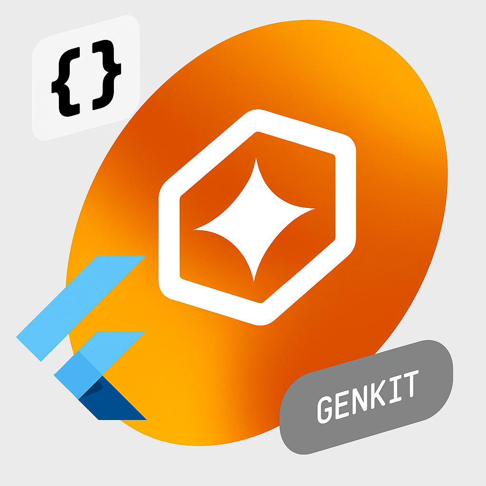
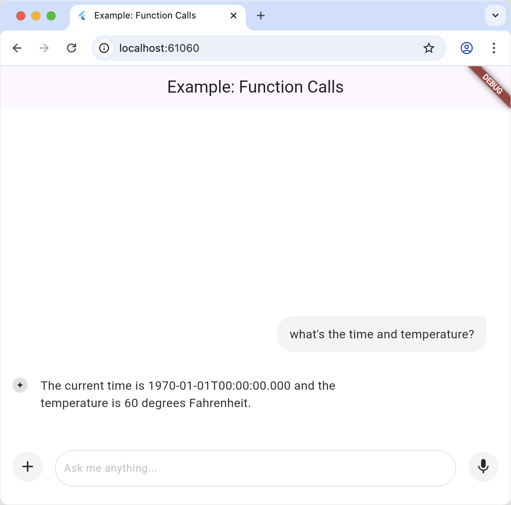
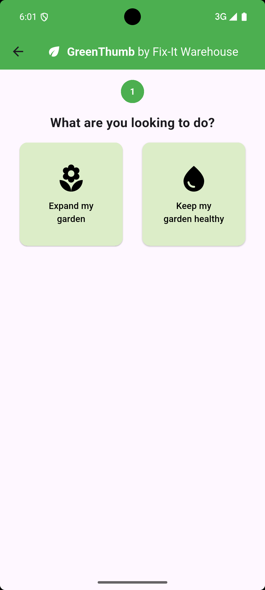
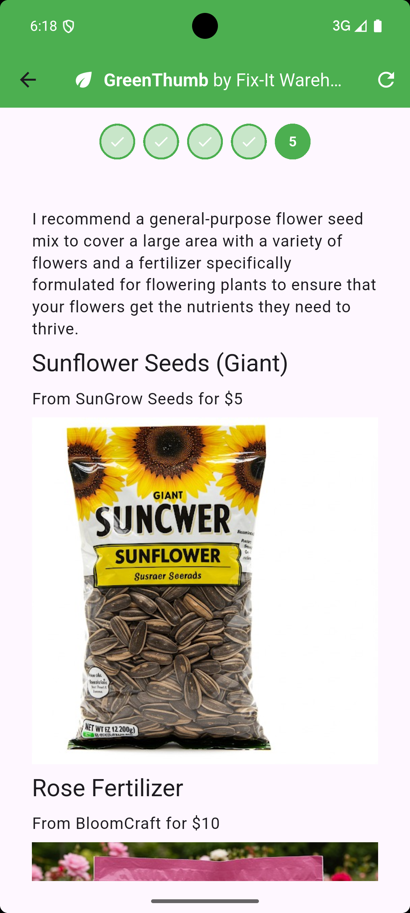
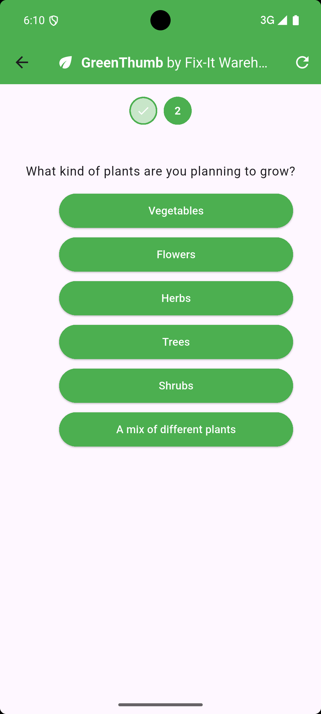

Tags: flutter

# Flutter AI Tool Calling



A little while ago, I was inspired by [Thorsten's blog post](https://ampcode.com/how-to-build-an-agent) on building an AI Agent using Rust to [build an AI Agent using Dart](https://sellsbrothers.com/ai-agent-with-dart-gemini). The combination of a conversation with Gemini and a set of tools allowed us to build an agent that could take some prompts from the user and turn them into not just responses (Ask mode), but actions (Agent mode!). In the spirit of [Agentic Apps month for Flutter](https://flutter.dev/events/building-agentic-apps) this month, I wanted to share how to do the same thing in your Flutter app using the most recent release of [the Flutter AI Toolkit](https://pub.dev/packages/flutter_ai_toolkit).

## Flutter AI Toolkit v0.9.0

As we near the 1.0 release of the AI Toolkit, the community has continued to contribute features that they'd like to see in a customizable, style-able and LLM-pluggable widget you can use when you'd like to enable your users to be able to talk to an AI in the context of your app.

In this case, Toshi Ossada contributed [a PR that provided the inspiration for tool calling](https://github.com/flutter/ai/pull/99) for the new `FirebaseProvider` in the AI Toolkit. This new provider replaces both the `GeminiProvider` and the `VertexProvider` as described in [the migration guide for v0.9.0](https://pub.dev/packages/flutter_ai_toolkit#migration-to-v090).

Tool calling is the ability to augment an LLM with a set of functions -- what the AI industry refers to as "tools" -- that the LLM can call when it needs the data that the tools provide. For example, an LLM by itself has no idea what time it is; it needs to have some tool that can provide that information and if it doesn't have one, it'll just make something up. With confidence.

Here's an example of how to provide tools to the `FirebaseProvider`: 

```dart
class ChatPage extends StatelessWidget {
  const ChatPage({super.key});

  @override
  Widget build(BuildContext context) => Scaffold(
    appBar: AppBar(title: const Text(App.title)),
    body: LlmChatView(
      provider: FirebaseProvider(
        model: FirebaseAI.googleAI().generativeModel(
          model: 'gemini-2.0-flash',
          tools: [
            Tool.functionDeclarations([
              FunctionDeclaration(
                'get_temperature',
                'Get the current local temperature',
                parameters: {},
              ),
              FunctionDeclaration(
                'get_time',
                'Get the current local time',
                parameters: {},
              ),
            ]),
          ],
        ),
        onFunctionCall: _onFunctionCall,
      ),
    ),
  );
  
  ... // _onFunctionCall goes here...
}
```

This code initializes the model with two tools: `get_temperature` and `get_time`. These tools come with names and descriptions so that the model can understand what they're for and make an informed decision  about when to call them.

The model is also initialized with an `onFunctionCall` callback so that when the LLM wants to use one of those tools, your function is called to handle it:

```dart
class ChatPage extends StatelessWidget {
  ...

  // note: we're not actually calling any external APIs in this example
  Future<Map<String, Object?>?> _onFunctionCall(
    FunctionCall functionCall,
  ) async => switch (functionCall.name) {
    'get_temperature' => {'temperature': 60, 'unit': 'F'},
    'get_time' => {'time': DateTime(1970, 1, 1).toIso8601String()},
    _ => throw Exception('Unknown function call: ${functionCall.name}'),
  };
}
```

We're just returning hard-coded values here, but this is the place where you'd look up the data that the LLM wants as part of fulfilling the user's request, as shown here:



In this example, we're just looking up information that the LLM would have trouble getting on it's own. However, if a call to a tool has a side affect then BOOM you've moved from Ask mode to Agent mode. Welcome to the future!

## Flutter + Genkit + Interrupts (oh my!)

This all works great so long as everything is handled on the client-side. However, as soon as you mix in server-side LLMs, for example by using Genkit, you have some additional considerations to take into account.

[Genkit](https://firebase.google.com/docs/genkit) is an open-source framework for building full-stack AI-powered applications, developed and used in production by Google. It currently has language support for Typescript/Javascript, Go and Python but unfortunately not Dart. However, if you're willing to write some Typescript, it turns out that Genkit has great support server-side tools handled by Flutter apps with something called interrupts.

A Genkit [interrupt](https://genkit.dev/docs/interrupts/) is a tool that's invoked on the server but fulfilled on the client.

*"How can that work?"* I'm hearing you ask through the Interwebtubes.

Well let me tell you.

The way an LLM tool works is that during the handling of a request, if there's a tool involved, the LLM API will call back into the function you provided via a callback like `onFunctionCall` . That call might take a while, e.g. you may need to dial up the national weather service, but when, the `Future` will complete and the LLM will be able to carry on.

*"That's great,"* you say. *"But how do I stretch a function callback over the wire from a Genkit server to a Flutter client?"* You ask such good questions.

Well, as it turns out, tool calls being invoked in the middle of an LLM response is an API fiction. What's really happening is that when an LLM wants to call a tool, it replies with a message marked as a tool call and that include the tool arguments. The LLM client library -- like the `firebase_ai` package -- notices this, calls your callback function, bundles up the response and continues the conversation without bothering you about it at all until the actual LLM response comes back, having taken into account the results of the tool call(s).

For example, the user's request above in a single prompt looks like it returns a single response, but looking at the actual message history tells a different story:

```json
[
  {
    "role": "user",
    "parts": [
      {
        "text": "what's the time and temperature?"
      }
    ]
  },
  {
    "role": "model",
    "parts": [
      {
        "functionCall": {
          "name": "get_time",
          "args": {}
        }
      },
      {
        "functionCall": {
          "name": "get_temperature",
          "args": {}
        }
      }
    ]
  },
  {
    "role": "function",
    "parts": [
      {
        "functionResponse": {
          "name": "get_time",
          "response": {
            "time": "1970-01-01T00:00:00.000"
          }
        }
      },
      {
        "functionResponse": {
          "name": "get_temperature",
          "response": {
            "temperature": 60,
            "unit": "F"
          }
        }
      }
    ]
  },
  {
    "role": "model",
    "parts": [
      {
        "text": "OK. The current time is 1970-01-01T00:00:00.000 and the temperature is 60 degrees Fahrenheit."
      }
    ]
  }
]

```

*"OK,"* you say warming up to another question, *"but what's that got to do with Genkit and server-side tool calls?"* I'm getting there!

## Genkit Tools

Genkit also provides for tool calls, as shown in [this example](https://genkit.dev/docs/tool-calling/):

```typescript
// define a tool
const getWeather = ai.defineTool(
  {
    name: 'getWeather',
    description: 'Gets the current weather in a given location',
    inputSchema: z.object({
      location: z.string().describe('The location to get the current weather for'),
    }),
    outputSchema: z.string(),
  },
  async (input) => {
    // Here, we would typically make an API call or database query. For this
    // example, we just return a fixed value.
    return `The current weather in ${input.location} is 63°F and sunny.`;
  },
);

// use a tool
const response = await ai.generate({
  prompt: "What is the weather in Baltimore?",
  tools: [getWeather],
});
```

This is semantically the same -- we define a tool that the LLM can call during a request. And again, it looks like a seamless callback, which you need to implement on the server, even though we know there is a flow of messages underneath just like what we see above.

But what if you could interrupt the flow of messages when there's a tool call, pass the stack of messages back to the Flutter app and let it fill in the results? That's exactly what Genkit interrupts are for.

## Genkit Interrupts: Human in the Loop

From the Genkit docs: "Interrupts are a special kind of tool that can pause the LLM generation-and-tool-calling loop to return control back to you. When you’re ready, you can then resume generation by sending replies that the LLM processes for further generation."

As an example, imagine that you've got an app that helps people with their plants, maybe expanding their garden or diagnosing their sick plants.



Further imagine that you've got an LLM in your server-side code with access to a database of products that can help users with their plant needs.



Now imagine that the LLM has been instructed to ask the user a set of questions to clarify the plant needs before recommending one of those products.



Since the LLM is running in your Genkit server with access to your server-side database of products, to involve the user of your Flutter app in a conversation, you've now got the perfect storm for using interrupts to keep the "human in the loop."

To implement this in Genkit, you define your tools as interrupts so that the LLM can pause the response to gather data from the user:

```typescript
const choiceInterrupt = ai.defineInterrupt(
  {
    name: 'choice',
    description: 'Asks the user a question with a list of choices',
    inputSchema: z.object({
      question: z.string().describe("The model's follow-up question."),
      choices: z.array(z.string()).describe("The list of choices."),
    }),
    outputSchema: z.string().describe("The user's choice."),
  });
```

In Genkit, an endpoint that you can call from your Flutter app via HTTP is called a "flow":

```typescript
const greenThumb = ai.defineFlow(
  {
    name: "greenThumb",
    ...
  },
  async ({ prompt, messages, resume }) => {
    const response = await ai.generate({
      ...(messages && messages.length > 0 ? {} : { system: gtSystem }),
      prompt,
      tools: [choiceInterrupt, ...],
      messages,
      resume,
    });

    return { messages: response.messages };
  });
```

Notice that the `greenThumb` flow takes a set of messages and returns a set of messages. To kick things off in your Flutter code, you pass an empty list of messages. If the last message in the LLM response is an interrupt, it will include the info you need to show a UI to ask the user to answer the LLM's question:

```json
{
  "messages": [
    {
      "role": "system",
      "content": [
        {
          "text": "\n  You're an expert gardener. The user will ask a question about how to manage\n  their plants in their garden. Be helpful and ask 3 to 5 clarifying questions,\n  using the choiceInterrupt tool.\n  \n  When you're done asking questions, provide a description of a product or\n  products that will help the user with their original query. Each product\n  description should NOT include another question for the user nor should it\n  include the name of any specific product.\n"
        }
      ]
    },
    {
      "role": "user",
      "content": [
        {
          "text": "I'd like to expand my garden."
        }
      ]
    },
    {
      "role": "model",
      "content": [
        {
          "text": "That's great! To give you the best advice, I need a little more information.\n\n1.  What kind of plants are you planning to add to your garden (e.g., vegetables, flowers, shrubs)?\n2.  What is the approximate size of the area you're planning to expand?\n3.  What type of soil do you have in your garden currently (e.g., sandy, clay, loamy)?\n4.  What is the average amount of sunlight your garden receives each day?\n\n"
        },
        {
          "toolRequest": {
            "name": "choiceInterrupt",
            "input": {
              "choices": [
                "Vegetables",
                "Flowers",
                "Shrubs",
                "Other"
              ],
              "question": "What kind of plants are you planning to add to your garden?"
            }
          },
          "metadata": {
            "interrupt": true
          }
        }
      ]
    }
  ]
}
```

This continues until the LLM gathers the data it needs to provide a response:

```json
{
  "messages": [
    ...
    {
      "role": "model",
      "content": [
        {
          "text": "Based on your answers, here are a couple of product descriptions that might be helpful for expanding your flower garden:\n\n**Product 1:** This soil amendment is designed to improve drainage and aeration in existing soil, while also providing essential nutrients for healthy root development. It's perfect for preparing new garden beds or revitalizing existing ones. Simply mix it into the top layer of soil before planting to create an ideal environment for flowers to thrive.\n\n**Product 2:** These granular plant food spikes provide a slow-release source of nutrients for flowering plants. They are easy to use - simply insert them into the soil around your existing plants, and they will gradually release nutrients over an extended period, promoting vibrant blooms and strong growth. They're especially beneficial for areas with full sun exposure, as they help plants maintain consistent access to the resources they need.\n"
        }
      ]
    }
  ]
}
```

Of course, there are a lot of picky details to get this right, so I'll refer you [my flutter_fixit_warehouse sample](https://github.com/csells/flutter_fixit_warehouse/), which provides all of the code and a more thorough explanation.

## Where are we?

With the latest updates to the Flutter AI Toolkit, you can now build tool calls into your Flutter agentic apps. Furthermore, with Genkit's support for interrupts, you can keep the human in the loop by handling server-side tool calls with input from your Flutter app users.

Now, with these new tools in your toolbox, go forth and build!