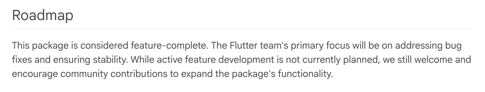

# Critical Flutter OSS Projects Need Love! (aka Funding)

In [a recent tweet](https://x.com/dinkomarinac/status/1938634757702582497), Dinko makes an excellent point about much of our Dart ecosystem being a "hobby project" or having "limited support." He's not wrong and that applies to Flutter as well. Most of the Flutter ecosystem is driven by passionate OSS developers. And that passion drives different devs to do different things -- some like the code, some like the samples, some like the docs, some like the support and some just like to publish a package right out of `flutter create` and then move on with their day. What is true, however, is that few packages get professional-quality care. For that, you typically need money.

## Flutter Favorites

The [Flutter Favorite](https://docs.flutter.dev/packages-and-plugins/favorites) program was invented to give recognition to developers building high-quality packages that really serve the Dart and Flutter community. And it worked. From the time that the Flutter Favorites program was launched until I lost access to internal Google metrics, not only was the number of packages on pub.dev continuing to grow, but so was the average quality. These are not metrics that typically go together, but by motivating the community to strive towards a higher bar of quality, we were able to drive both numbers up.

Unfortunately, I believe that we've reached a quality plateau. And I think I know why.

## The Need for Flutter Funding

One of the jobs of the Flutter Favorites committee was to keep the needs of the community in mind and to work with authors on the cusp of meeting the quality bar to get over that hump with encouragement and help. As one example, I remember reaching out to the author of a popular BLE package that needed some work. There was some missing functionality and the overall package didn't meet the quality bar, but it was a great start and clearly filling a real need in the community. The author told me that he'd love to be a Flutter Favorite, but he was too busy working to pay his mortgage and feed his family. If we had perhaps had a small amount of funding...

Unfortunately, there was no funding for such things at the time. And except for [the FlutterFlow Flutter Funding program](https://www.flutterflow.io/fund) (which sounds great, btw, but may be biased towards projects that overly favor FlutterFlow), there is no broadly-focused organization whose job it is to fund engineering projects in the Dart and Flutter ecosystem.

As [Eric Seidel pointed out recently](https://sellsbrothers.com/dart-and-flutter-packages-need-your-love), many critical packages in our ecosystem are showing their age. When you [look at the data](https://sellsbrothers.com/dart-and-flutter-packages-need-your-love) — packages like `google_sign_in` with 69 open issues, `flutter_barcode_scanner` with 188 open issues and no updates in 3 years — it's clear that we have a sustainability problem. The community is willing to help, but maintainers need time, and time costs money.

I have an idea.

## Proposal: Flutter Funding Committee

I've been working on a proposal to create the **Flutter Funding Committee** (FFC) — a non-profit organization designed to fill exactly these funding gaps. The idea is simple: take donations from companies deeply invested in the flourishing Dart and Flutter ecosystem and use that money to fund important community projects that would otherwise fall through the cracks. Think of it as an "escape valve" that allows the Dart and Flutter team to move maintenance work off their plate without dropping any balls (to shake a couple of metaphors together with a swizzle stick).

The committee would fund things like:

- **Maintenance** and improvement of critical pub.dev packages that are widely used but under-resourced
- **Bug fixes** and improvements in Flutter/Dart that are important to the broader ecosystem but not on the current roadmap
- **New tools, packages or plugins** that fill gaps in the ecosystem
- Bounties for **targeted issues or enhancements** requested by the community

But here's the key differentiator from similar foundations -- like Python Software Foundation or the OpenJS Foundation -- the FFC explicitly would NOT take over technical governance. The FCC would be purely a funding mechanism to support the ecosystem around that core.

## Projects We Could Fund

So what would this look like in practice? Let me give you some concrete examples of the kinds of projects the FFC could tackle:

**Emerging Tech Integration**: Want to see Flutter work better with emerging technologies? Let's fund someone to build proper WebAssembly integration, or an agentic toolkit like the cool Python kids have, but for Dart!

**Critical Package Maintenance**: Remember that BLE package I mentioned? Or  `google_sign_in`. Or another package near and dear to my heart `go_router`. It's currently in maintainence mode, but 257 (!) open issues with almost 2M downloads. This is a package in need of some love.

------

------

**Desktop Feature Gaps**: Flutter's desktop support is solid but still has gaps that the core team hasn't prioritized. Things like better window management, system integration features, or platform-specific UI components that would make Flutter desktop apps feel truly native.

And the list goes on...

The beauty of the FFC approach is that the companies funding these projects would get to vote on what gets priority. If you're a company building Flutter apps for enterprise customers, you might prioritize desktop features. If you're focused on mobile, maybe you care more about social auth. The market gets to decide, but through a coordinated effort rather than everyone building their own solutions in isolation and then dropping them on the floor when something new and shiny comes along.

## Where Are We?

This isn't just a pipe dream. I've already had conversations with key players in the Flutter ecosystem, and the response has been larely positive (although nobody has written a check yet : ). Companies that depend on Flutter for their business understand the value proposition immediately — instead of each of them solving ecosystem problems in isolation, they can pool resources and tackle the big issues together.

What I find most exciting about this approach is that it builds on the proven success of the Flutter Favorites program. We know that recognition and quality standards work. Now we're just adding the missing piece: funding to make those standards achievable for maintainers who care but can't afford to work for free.

The Flutter ecosystem has grown up. We've got millions of developers, thousands of companies betting their businesses on Flutter, and a package ecosystem that rivals any platform out there. It's time our funding mechanisms grew up too.

If you're interested in this idea — whether as a potential funding company, a maintainer who could benefit, or just someone who cares about Flutter's long-term health — I'd love to hear from you. Because the future of Flutter isn't just about what Google builds; it's about what we build. Together.
