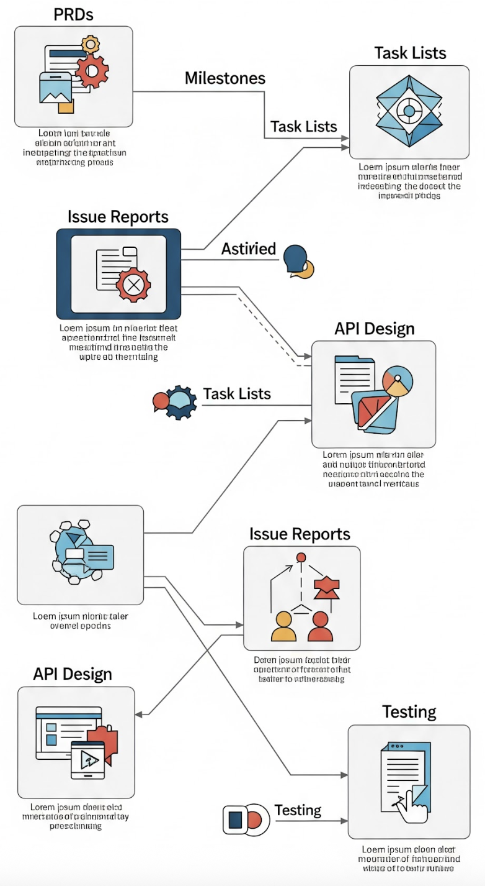
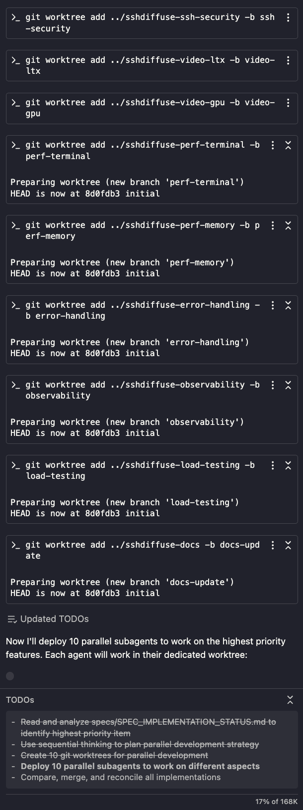
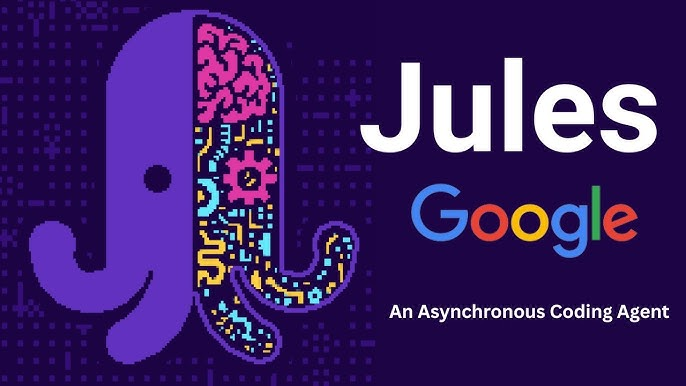

# The 5 Stages of AI Grief

> *"The future is already here – it's just not very evenly distributed."* –W. Gibson

As a consultant and speaker, I talk to a lot of software engineers. As AI coding tools have gotten better (and they have gotten *much* better), I've watched engineers move through what feels a lot like the stages of grief. 

## 1. Denial: "AI is a fad. It'll go away soon."

I still run into a large number of engineers who are convinced that AI coding is just hype that'll blow over like so many other tech fads (Web 3, blockchain, NFTs, ... they have a point). They refuse to even try ChatGPT, Copilot or Claude Code. They've been writing code the same way their whole lives and why should they change now?

## 2. Anger: "AI doesn't work. I tried it two years ago and it sucked."

Some engineers *have* tried AI coding tools, but they tried them when they were genuinely pretty bad. GPT-3.5 in early 2023 was... let's call it "inconsistent." So they tried it, it failed to solve their problem, and they walked away convinced that AI coding was overhyped nonsense.

Or, these are the engineers who have strict company policies about which tools and which LLMs that they can and can't use, often in-house, self-made stuff that leaves something to be desired. To be fair, these home-grown tools often do suck.

The problem is that these engineers haven't (or aren't allowed to) try the current crop of tools. They don't realize that the AI that couldn't write a for-loop eighteen months ago can now architect entire applications, if used correctly. But until they get over that hump, they're not going to see the value in them.

## 3. Depression: Vibe coding: "Build me a healthcare app"

This is the stage where engineers realize AI actually works, but they're holding it wrong. They're trying to go from zero to sixty in 3.5 seconds with prompts like "Build me a healthcare app" or "Fix this bug in my code."

Vibe coding works great when you're building something small and self-contained. But then you ship that healthcare app and get hacked with an SQL-injection attack because you're not an engineer at all and you don't know what SQL injection is. That's when the depression sets in.

The tool isn't the problem. The problem is treating AI like a magic wand instead of a chainsaw. The chainsaw will get the job done, but you've got to know what you're doing or you're just going to hurt yourself.

## 4. Bargaining: Describe coding: "Let's design a new feature"

> I don't do "vibe coding." OK. Well. I have "experimented" with it. But I was younger. And I needed the money. And it was tastefully done!
>

Now, I've grown a bit and realize that there are better ways. I've adopted a technique I call "describe coding" (patent pending. all rights reserved. I do own the domain name : ). Instead of leaping right into "build me a thing that does a thing", I start with "let's think about this for a minute." I like AI coding tools that have an explicit planning mode, but even without that mode I use prompts like "I'd like to design a ... It should work like ... It should have these constraints... ask any questions you may have before you start coding." Actually, that last sentence I use so often, I've stored it in a snippet behind a hotkey on my Mac.

I collaborate on the AI until we come up with a design I like. Then the implementation. Then fixing the compiler errors (and the warnings, I'm not an animal!).

> Then I dump each substantial feature into a design doc for future use. It will be useful in the future to get myself and the AI on the same page when it's time for updates/bug fixes.

Then I generate tests and run them till they pass, being careful to really check that the tests model the behavior I want. Then update the docs and produce the PR.

Notice what I'm doing: design => implementation => testing => ...

This is the standard practice that we've been doing for decades. You could call the use of my traditional software engineering techniques "bargaining" but I like to think of it as applying the techniques that really work, but in a new way.

The combo of AI + the application of software engineering is where the magic happens, letting me code in minutes or hours what used to take days or weeks. The AI becomes a super-fast pair programming partner instead of a glorified autocomplete.

Plus, it's so much frickin' fun, I can't stand it! If you only get to this stage, you'll do well with AI coding.

And there's still one more stage to go!

## 5. Acceptance: Orchestrating agent swarms

The engineers who've made it to acceptance aren't just using AI to write code. They're orchestrating whole sets of them. Personally, I like to keep about three projects going at once, switching between them, using different instances of my favorite AI coding agent of the week (things are changing *really* fast). Even keeping to just a few projects, I still find myself with the "oops wrong chat" problem, so that may be my limit.

Some people are pushing the limits, however, by combining AI agents at the command line with tmux and a little known feature of git called "worktrees," which gives each agent instance its own playground.

Once you're swarming, you're not a software engineer anymore -- now you're an engineering manager with a team. Swarm mode is where your points *really* rack up.

## 1. Denial... Again: "Remote coding"

Remote coding is giving AI agents in the cloud access to your repo and asking them to do things; they can create entire PRs without you ever seeing the code or the running app.

> There is a growing set of AI coding products that provide for the "close your eyes and think of England" kind of remote asynchronous coding and it's not OK with me!

And so the cycle begins again with denial.

## The Questions We're All Asking

When I discuss the advancement of AI into our day to day work with folks, some questions keep coming up:

**Will using AI atrophy my knowledge?** Some skills will almost certainly atrophy - that's what happens to muscles that aren't used. But we lost our tails because we never used them either. If something dries up and falls off due to misuse, how important was it in the first place?

**Will AI take my job?** I honestly don't know. But I do know this: software engineers who use AI tooling are going to be more effective and efficient than those who don't. And when promotion time comes around, or when layoffs happen, effectiveness and efficiency are good qualities to have.

**Will AI produce more, different jobs?** Every single technology we've ever invented has put someone out of work. When Grog the plump caveman lost his cuddling-to-keep-the-tribe-warm job after fire was invented, his extra berries at bedtime were gone.

> I don't know what happened to Grog, but I can tell you that the invention of fire led to pretty much every other job. Should we avoid a new technology because it points to an uncertain future?
>

Every new technology seems different - this one *only* destroys jobs and doesn't create them - because the lost jobs happen first and we can't see into the future. The Luddites broke into fabric mills and destroyed steam-powered looms because they didn't want to lose their jobs. Of course, we ended up creating many more jobs with the machines that looms ultimately led to than the looms ever created on their own.

Is AI going to be different? Is it only going to destroy jobs and not create them? I don't know. But if that were the case, it would be unique in human history.

## Where Are We?

All technology advances happen faster now. The spread of electricity took ~45 years to reach 25% of the US population. The internet took ~7 years. AI has been making changes in our society as large as those other two in just 2.5 years. What that means for us puny humans, I don't know.

But here's what I do know: the grief you're experiencing with the oncoming AI is real. We are losing things. We're already losing knowledge and skills. Artists and other content creators seem to have lost their IP. The new people entering every field that uses AI are going to do things differently; the old ways will be lost.

The question isn't whether we're going to lose things with AI. The question is: is what we gain going to be worth it? Will it be a higher standard of living for our children? Will AI help us solve real-world problems that we've been unable to solve ourselves? Once we get over the grief, will we be able to experience joy in the new world that we've created for ourselves?

I hope so.

The engineers who are curious, who are experimenting, who are moving through these stages thoughtfully - I believe that they'll do just fine in whatever future we create for ourselves. The ones who get permanently stuck in anger or denial? I think they'll have a harder time.

The future is already here. What are you going to do about it?