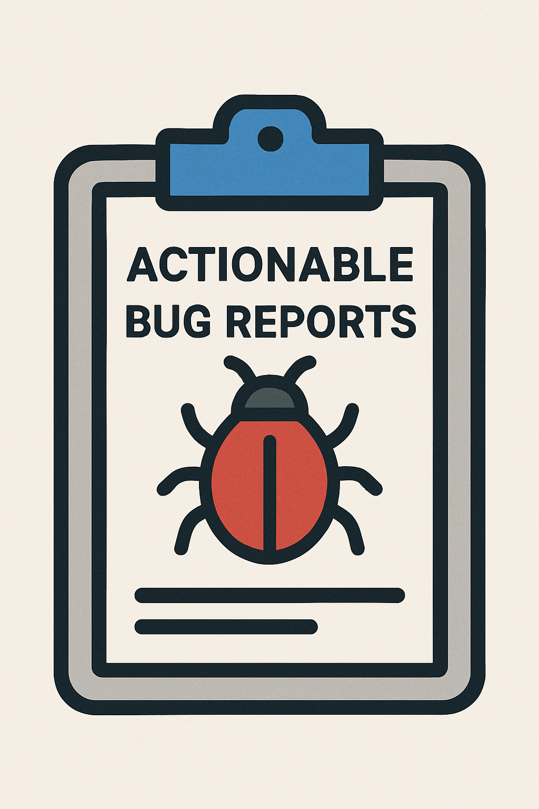

# How to Write Actionable Bug Reports

I often find myself maintaining open source projects. I've contributed to many over the years, even hosting multi-person "source available" projects on this very website in zip files before there were such things as GitHub or Pull Requests or Open Source Software. No matter what mechanism I'm using to manage the project, if it's popular, I get issues filed against that project. Those issues break down into two categories:

1. Feature Requests
2. Bug Reports

## Feature Requests: Include Why

If it's a feature request, I'll ask that you include *why* you're asking for a feature as well as *what* you're asking for. It's pretty typical for an engineer to have a problem, wish for a particular solution and then ask for it. However, it's often the case that someone using the project doesn't quite have the entire architecture in mind when they ask for a solution, which means that the requested solution might not fit in well with the rest of the project.

On the other hand, if you can include *why* you're asking for a specific solution, i.e. what problem are you trying to solve, then the maintainer of the project can say "no, but..." with an alternative solution that does fit in with the architecture.

A good maintainer will ask why before saying no, but if you provide the why out of the gate, you could save yourself a round trip in the issue's comments.

## Bug Reports: Include a Minimal Repo Project

If the project in question does something that you thought the project should already do but it doesn't work the way you expect, e.g. sets fire to your garage, then that's a bug report. For a bug report to be useful, it has to be *actionable*.

More sophisticated projects will include a template that asks pertinent questions like:

* What behavior did you see?
* What behavior did you expect to see?
* What error message did you get?
* ...

However, for me, the biggest thing that makes a bug report actionable is the inclusion of a ***minimal reproduction project***. Each one of the words in that phrase is important and we'll go through them back to front:

* **Project:** I'm looking for the code for an entire project, ideally in a zip file, that I can download, unzip, load up into my IDE, resolve dependencies and run. The project should have everything in there that I need or, if there is something I need to add, like an API key, there should be a clear and prominent comment that makes that clear.

  In a pinch, I'll take a single source code file where the rest of the project is implied, but it needs to be self-contained and complete.

  The goal is that I can take your code and run it with no muss or fuss. The more popular the project I'm working on is, the more bug reports I'm going to get and the less time I have to spend on each one. Please make it quick and easy for me to run the code that demonstrates your issue, which brings me to...

* **Reproduction:** The code you send me should reproduce your issue! And it should put it in my face loud and proud. If it's an intermittent problem and I can't get it to happen with a reasonable number of runs, then there's not a lot I can do to fix it. The goal is to make it clear what the issue is and if it's not, I'm going to have to drop a comment into the conversation and move on.

* **Minimal:** Please please please do not copy and paste your personal or -- even worse -- your company's proprietary code into a project issue. I don't want to see that stuff! And there's often so so much of it! I want you to spend time removing anything domain-specific and trimming out the code that does not contribute to the problem. I do this for several reasons:

  1. I don't want your lawyers suing me for someday building something that is similar to something you once posted in a bug on one of my projects.
  2. I want you to have done the legwork to verify that the problem is in my code and not yours. If you trim away the extraneous, then you'll either figure out that it's your problem or mine.
  3. If the problem is mine, your minimal repro project is going to make it clear to me that it is my problem, because you've cleared away everything that isn't contributing to the issue. And this helps me to fix it more quickly.

## Just One Example

As an example, I saw a bug report recently on [the Flutter AI Toolkit](https://pub.dev/packages/flutter_ai_toolkit), a project I'm working on with the Flutter team. A very nice person posted an issue which seemed like a bug to me, if it's true, so I wanted to get to work on it right away. However, the bug wasn't actionable because it didn't have a minimal repro project, so I posted a comment asking for one.

The person responded quickly with a repro project, but I suspected that it was not minimal because it had domain-specific details in it and there were style settings used. The style settings were a dead giveaway because the issue had nothing to do with look 'n' feel. So I asked the person to work on the "minimal" part of the "minimal reproduction project" and moved on to my next task.

And then they got back to me with a minimal repro project so I could get to work on their issue.

## Where Are We?

I am a huge fan of people reporting issues in my projects. Every one of them is an opportunity to make it more useful for a wider set of people, which is why I enjoy working on OSS projects in the first place. If you don't post issues that are actionable, that's OK -- I'll ask for the info I need. But if you'd like to move things along a little bit more quickly for yourself, you work put yourself in the maintainer's shoes and provide the same info you'd need if you were going to fix the issue yourself.

Or, even better, consider a PR. : )